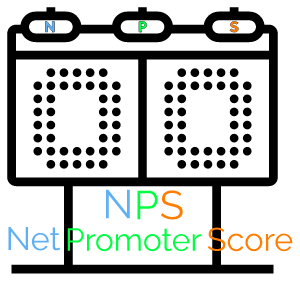

<p align="center">
  <a href="" rel="noopener">
 </a>
</p>

<h3 align="center">NPS API</h3>

<div align="center">


  
 
[](/LICENSE)

</div>

---

<p align="center"> This is just a simple Express API (NodeJS) that sends saved surveys to registered users' email and calculates NPS (Net Promoter Score) based on received users' survey answers. It's a project made during NLW#4 event promoted by 🚀 Rocketseat on their NodeJS path. <a href="https://en.wikipedia.org/wiki/Net_Promoter#:~:text=The%20Net%20Promoter%20Score%20is%20calculated%20by%20subtracting%20the%20percentage,of%20customers%20who%20are%20Promoters.">  Learn more about NPS Score</a>
    <br>
</p>

## 📝 Table of Contents

- [About](#about)
- [Getting Started](#getting_started)
- [Usage](#usage)
- [Built Using](#built_using)
- [Author](#author)
- [Acknowledgements](#acknowledgements)

## 🧐 About <a name = "about"></a>

The purpose of my participation on this event was of just curiosity. I've been told how great Rocketseat was, so I thought that I should get to know them better as well and see wether I'd learn something new. I liked those new (for me) libraries they chose to work on this project.

This API can register user's e-mail, save survey's questions, re/send an e-mail of any desired survey to any user's e-mail, receive a user's answer with a score in a range from 1 to 10.
I did add just a few fixes for original code and despite the fact they were so simple IMHO I think those should have been addressed during their presentation.

## 🏁 Getting Started <a name = "getting_started"></a>


### Prerequisites

Clone the repository

```
git clone https://github.com/trepichio/nps_api.git
```

### Installing

Follow these instructions once you're at project's root path in your favorite terminal.

Install dependencies

```
npm install
```

Rename .env.example file to .env

```
mv .env.example .env
```

by _default_ this web server will run at _port 3399_. If you want to run in a different port just open the .env file and change both the PORT variable and port value in URL_MAIL and save it.

run the migrations to create databse and its tables

```
npm run typeorm -- migration:run
```

and then run web server

```
npm run dev
```

Then you can consume one of its endpoints using your favourite REST API tool such as [Postman](https://www.postman.com/), [Insomnia](https://insomnia.rest/) or any other.

For example:
(GET) http://localhost:3399/surveys/ to retrieve all surveys from database or
(POST) http://localhost:3399/sendMail/ to send a saved survey to a registered user email, both parameters must be provided in the body of this request. More details about in section [Usage](#usage).

## 🔧 Running the tests <a name = "tests"></a>

You can run tests by

```
npm run test
```

Some tests are already coded that tests things such as if it can create users, avoid create a new user with an already existent email, can get a list of surveys and create new surveys.


## 🎈 Usage <a name="usage"></a>

Consume one of its endpoints using your favourite REST API tool such as Postman, Insomnia or any other.

- **POST** /users
  - Register a new user email
  - Parameters to pass into JSON request body: { name, email }

- **GET** /surveys
  - Retrieve all saved surveys

- **POST** /surveys
  - Save a new survey into database
  - Parameters to pass into JSON request body: { title, description }
  - Use *title* for the subject of email to send
  - Use *description* for the question

- **POST** /sendMail
  - Send an e-mail with a selected survey to a user's e-mail
  - Parameters to pass into JSON request body: { email, survey_id }
  - Use *email* for a registered user email
  - Use *survey_id* to select which survey send to

- **GET** /answers/:value?u=
  - This url will be in the score links in sent email. Used for update ONCE user's answer to a specific survey contained in their sent email.
  - *value* is the chosen score. A number from 1 to 10.
  - Parameter to pass into request query: u
  - Use *u* to pass surveyUser_id to identify which survey this user answer belongs to.

- **GET** /nps/:survey_id
  - Retrieve a calculation of NPS - Net Promoter Score of the specified survey and its related data.
  - Parameter to pass into url path: survey_id
  - Use *survey_id* to identify which survey to retrieve NPS data.

## ⛏️ Built Using <a name = "built_using"></a>

- [Typescript](https://www.typescriptlang.org/) - a Superset of Javascript that adds types check and more.
- [SQLite](https://www.sqlite.org/) - Database
- [Typeorm](https://github.com/typeorm/typeorm) - ORM for TypeScript and JavaScript.
- [better-sqlite3](https://github.com/JoshuaWise/better-sqlite3) - The fastest and simplest library for SQLite3 in Node.js.
- [Express](https://expressjs.com/) - Server Framework
- [NodeJs](https://nodejs.org/en/) - Server Environment
- [express-async-errors](https://github.com/Abazhenov/express-async-handler) - Async Error Handling Middleware for Express
- [Jest](https://jestjs.io/) - Testing Framework
- [Handlebars](https://handlebarsjs.com/) - Minimal templating on steroids
- [Nodemailer](https://nodemailer.com/about/) - a module for Node.js applications to allow easy as cake email sending.
- [Yup](https://github.com/jquense/yup) - Dead simple Object schema validation
- [Supertest](https://github.com/visionmedia/supertest#readme) - Super-agent driven library for testing node.js HTTP servers

## 👨‍🚀 Author
| [](https://trepichio.github.io) |
|:--------------------------------------------------:|
| [João Trepichio](https://trepichio.github.io)    |
| [🔥 GitHub](https://github.com/trepichio)

## 🎉 Acknowledgements <a name = "acknowledgement"></a>

- References:
  - [NLW#4 Rocketseat](https://rocketseat.com.br/)
  - [NPS Score Wikipedia](https://en.wikipedia.org/wiki/Net_Promoter#:~:text=The%20Net%20Promoter%20Score%20is%20calculated%20by%20subtracting%20the%20percentage,of%20customers%20who%20are%20Promoters.)